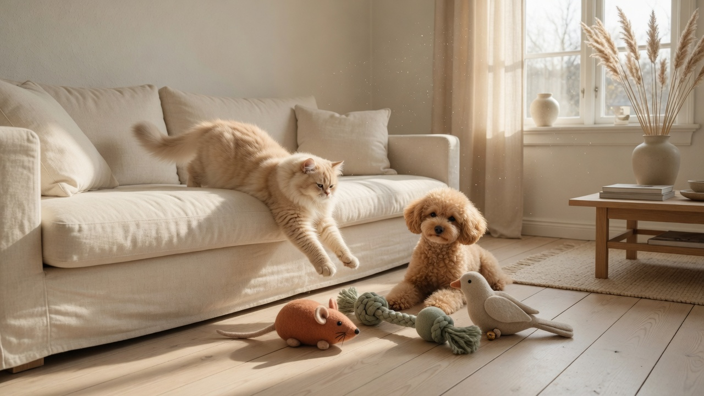
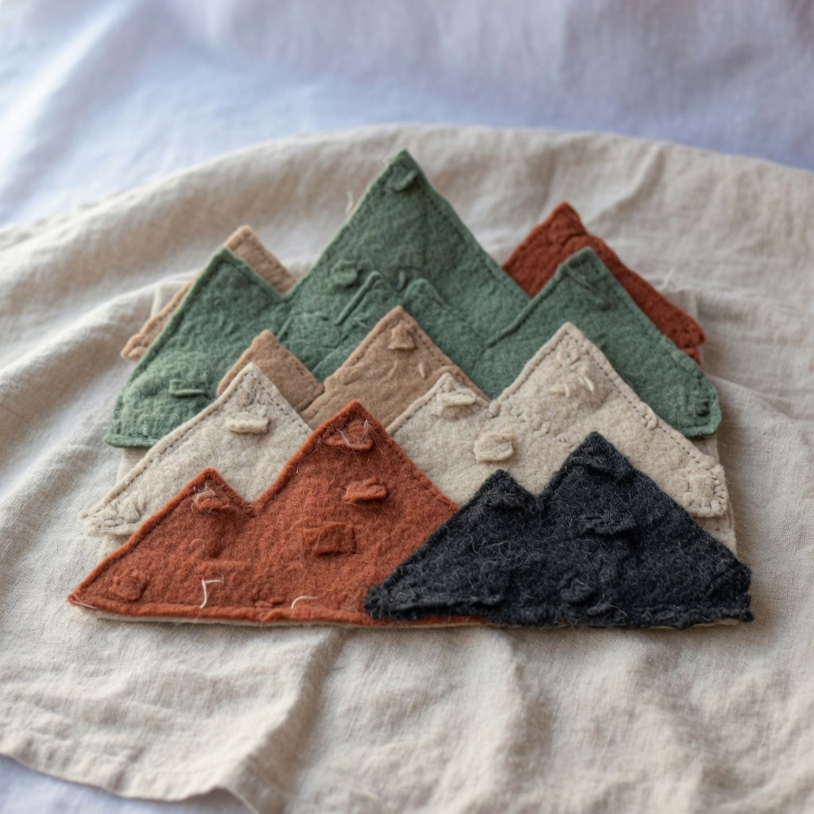
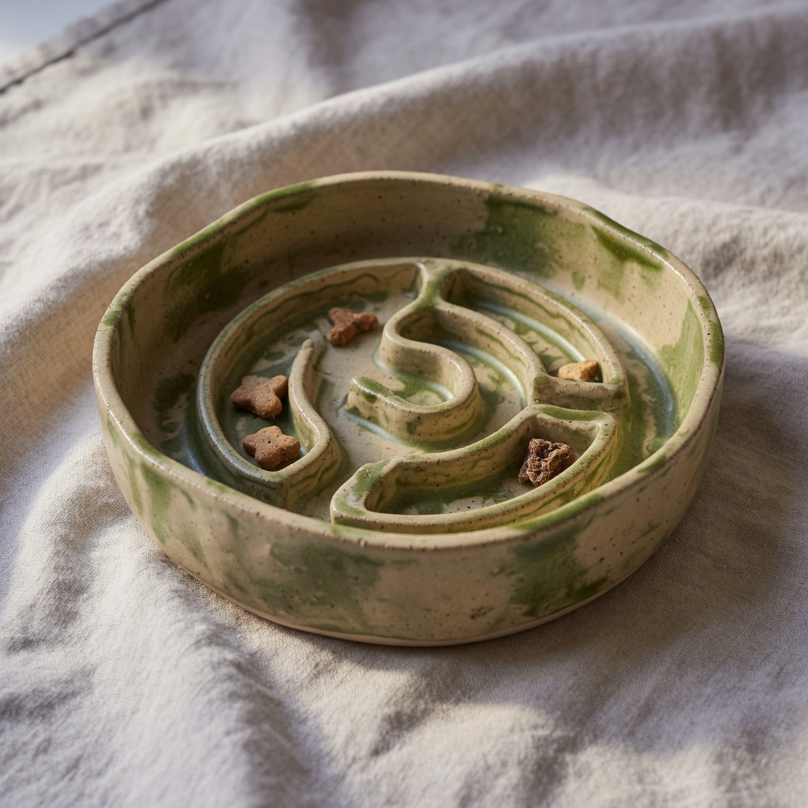
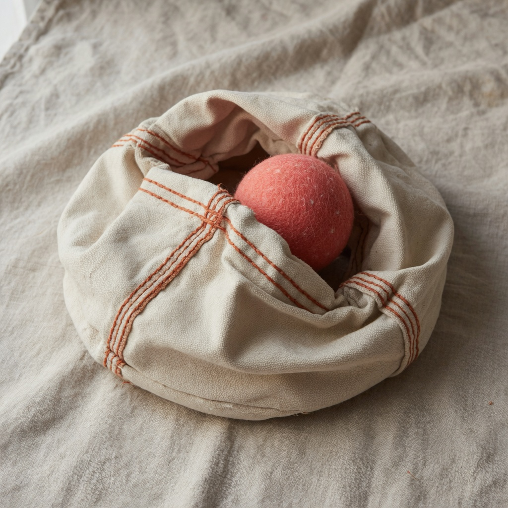
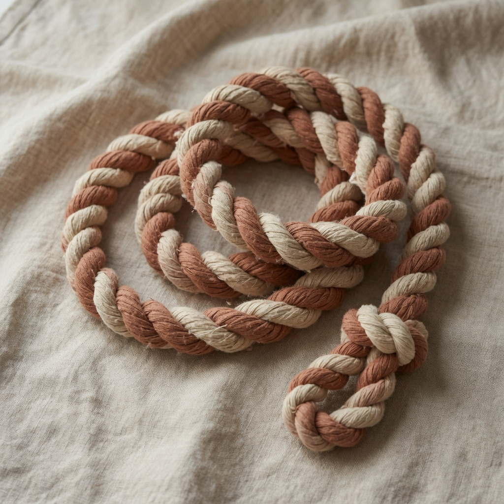
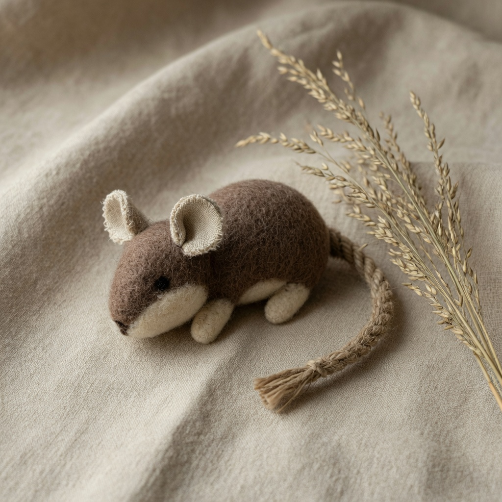
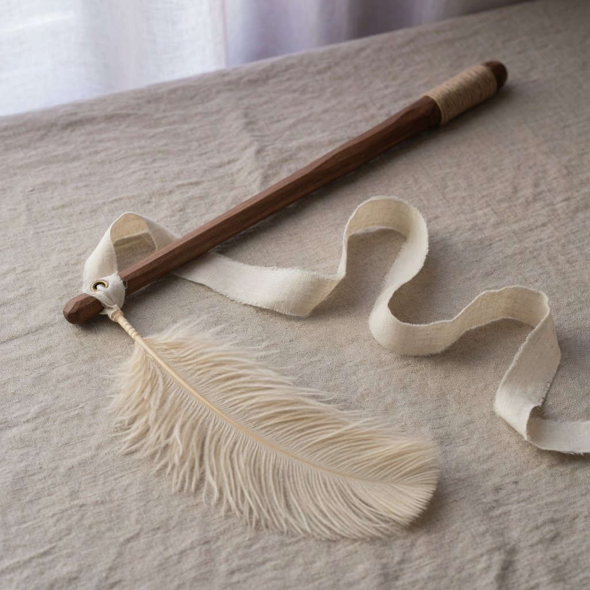
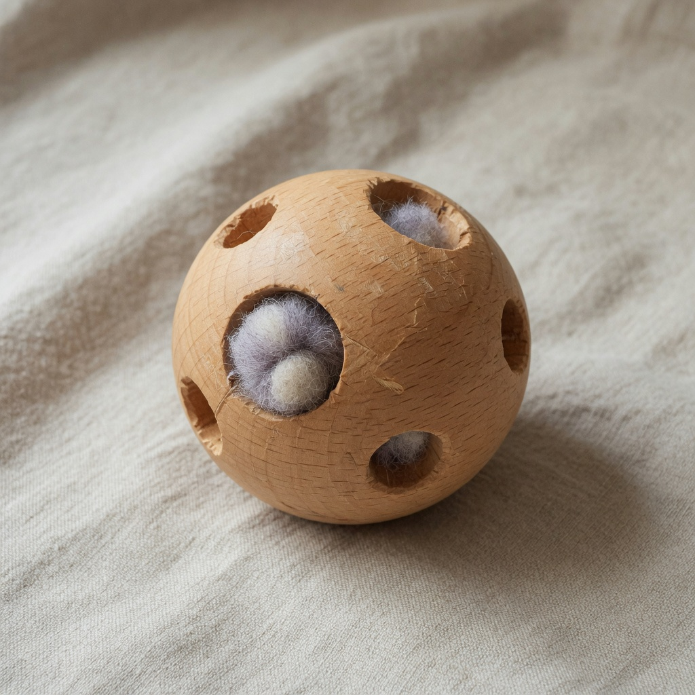
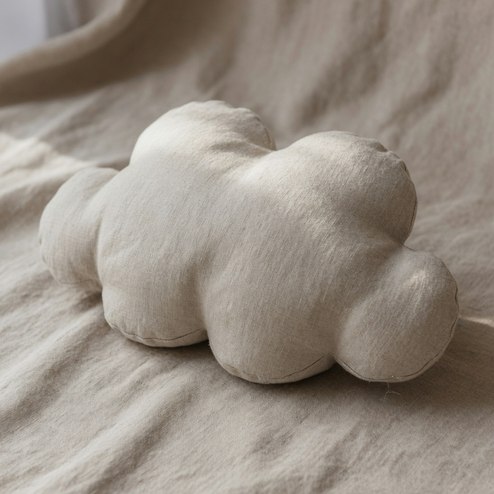

<div align="center">



# 趣爪 · Playpaw

**给毛孩子的好玩伴**

羊毛、棉绳和陶 —— 经得起玩，也放得进家里。

[](https://shuhuihuang0704.github.io/quzhao-playpaw/)
[](https://shuhuihuang0704.github.io/quzhao-playpaw/)
[](#-多语言支持)
[](#-技术说明)
[](#-技术说明)

[在线预览](https://shuhuihuang0704.github.io/quzhao-playpaw/) · [商品](#-商品一览) · [本地运行](#-本地运行) · [English](#english)

</div>

---

## 🐾 关于

**趣**是一起玩，**爪**是它踩过地板的声音。**智创**是先把玩法想明白，再用羊毛、棉绳和陶做出来。

对外英文名是 **Playpaw** —— 外国人一眼能读。

> 羊毛毡在浙江，陶碗在景德镇附近，木头在东阳车。每批不多，卖完再做，不赶。

我们做三件事：**嗅闻**、**啃咬**、**安抚**。羊毛从牧场来，陶从窑里来，木头车圆，帆布带着褶皱。

---

## ✨ 功能特性

| 功能 | 说明 |
|---|---|
| 🛍 **完整购物流程** | 首页 → 选物 → 商品详情 → 购物车抽屉 → 结账 → 下单成功 |
| 🌍 **6 语言实时切换** | 无需刷新，`localStorage` 记住选择，含阿拉伯语 RTL 从右到左排版 |
| 💰 **双币种显示** | 人民币 ¥ 与美元 $ 按语言自动切换 |
| 🛒 **购物车持久化** | 刷新、关页面都不丢，存于 `localStorage` |
| 🔗 **Hash 路由** | `#yama`、`#shop` 直达，可分享、可后退 |
| ⭐ **商品评分** | 五星分数条，支持用户打分 |
| 📱 **响应式** | 手机、平板、桌面自适应 |
| 🚫 **零依赖** | 无框架、无 npm、无构建步骤，打开 HTML 就能跑 |

---

## 🌍 多语言支持

内置 6 种语言，切换即时生效：

| 代码 | 语言 | 标题 | 方向 |
|:---:|---|---|:---:|
| `zh` | 中文 | 趣爪 Playpaw | LTR |
| `en` | English | Playpaw — Play, thought through | LTR |
| `ja` | 日本語 | 趣爪 — 趣爪イノベーティブ・ペットプロダクツ | LTR |
| `ko` | 한국어 | 취조 — Quzhao 펫 용품 | LTR |
| `th` | ไทย | Quzhao — ของเล่นสัตว์เลี้ยง | LTR |
| `ar` | العربية | كوزاو — منتجات الحيوانات الأليفة | **RTL** |

> 阿拉伯语会自动切换 `<html dir="rtl">`，整套版式镜像翻转。

---

## 🛍 商品一览

| 商品 | 名称 | 玩法 | 价格 | 评分 |
|---|:---:|:---:|:---:|:---:|
|  | **山峦嗅闻垫**<br><sub>Yama Sniff Mat</sub> | 嗅闻 | ¥268 / $38 | ⭐ 4.8 |
|  | **慢食陶碗**<br><sub>Wan Puzzle Bowl</sub> | 嗅闻 | ¥228 / $32 | ⭐ 4.7 |
|  | **帆布藏宝袋**<br><sub>Fukuro Burrow Bag</sub> | 嗅闻 | ¥198 / $28 | ⭐ 4.5 |
|  | **双色棉绳**<br><sub>Nawa Tug Rope</sub> | 拔河 | ¥168 / $24 | ⭐ 4.6 |
|  | **毡毛小鼠**<br><sub>Nezumi Felt Mouse</sub> | 逗猎 | ¥98 / $14 | ⭐ 4.9 |
|  | **胡桃逗猫杖**<br><sub>Hane Feather Wand</sub> | 逗猎 | ¥188 / $26 | ⭐ — |
|  | **榉木滚球**<br><sub>Tama Wood Ball</sub> | 逗猎 | ¥148 / $21 | ⭐ — |
|  | **云朵安抚枕**<br><sub>Kumo Cloud Cushion</sub> | 安抚 | ¥248 / $35 | ⭐ 4.8 |

**材料** —— 美利奴羊毛毡、有机棉、亚麻、麻绳、榉木、胡桃木、陶、帆布。
**没有**会响的塑料芯片，**没有**塑料眼睛。

---

## 🧱 技术说明

刻意保持极简：**纯 HTML + CSS + 原生 JavaScript**。

```
无框架  ·  无 npm  ·  无打包  ·  无构建步骤  ·  无外部依赖
```

| 层面 | 做法 |
|---|---|
| 结构 | 语义化 HTML，`<section>` 分区 |
| 样式 | 单个 `styles.css`，CSS 自定义属性（`--score` 等）驱动主题与评分条 |
| 交互 | 原生 JS，`PRODUCTS` 数据数组 + 视图函数（`viewHome` / `viewShop` / `viewProduct` / `viewCheckout` / `viewSuccess`） |
| 路由 | Hash 路由（`parseHash` / `go`），无需服务端配合 |
| 状态 | `localStorage` 存购物车与语言偏好（`storageGet` / `storageSet`） |
| i18n | `i18n.js` 维护词条字典，运行时 `hydrate()` 扫描并替换文本节点 |

---

## 📁 项目结构

```
quzhao-playpaw/
├── index.html          # 首页：Hero、选物、商品详情、关于、评论
├── account.html        # 账户页
├── checkout.html       # 结账页
├── styles.css          # 全部样式（含 RTL 适配）
├── app.js              # 商品数据、路由、购物车、视图渲染
├── i18n.js             # 6 语言词条与切换逻辑
├── .nojekyll           # 关闭 GitHub Pages 的 Jekyll 处理
└── images/             # 187 张图片
    ├── hero.jpg            # 首页主图
    ├── yama.jpg  …         # 商品主图
    ├── yama-play.jpg …     # 使用场景图
    ├── yama-sg.jpg …       # 尺寸 / 颜色变体图
    └── pet-*.jpg           # 宠物实拍
```

---

## 🚀 本地运行

**方式一 —— 双击运行**（macOS）

```
打开网站.command
```

会自动在 `8765` 端口起服务并打开浏览器。

**方式二 —— 任意静态服务器**

```bash
# Python
python3 -m http.server 8765

# Node
npx serve .
```

然后访问 **http://127.0.0.1:8765/**

> 💡 直接双击 `index.html` 也能看，但**建议用本地服务器** —— 这样 `fetch`、路由和图片路径的行为才和线上一致。

---

## 📦 配送与退换

| 项目 | 说明 |
|---|---|
| 起送 | 中国大陆满 **¥150** 起送 |
| 配送费 | 合计未满 ¥299 加收 **¥8**，满 **¥299 免配送费** |
| 海外 | 按实际运费计算 |
| 退换 | **七日内未使用**可退 |

> 已经玩过的，就留给它吧。

---

## 🔒 隐私

订单与账户信息**只用于发货和联系**，不会出售、出租或提供给无关第三方。您可来信要求查阅或删除个人资料。

---

## ⚠️ 安全提示

请**陪在旁边玩**。细小零件不适合咬得很凶的大型犬。棉绳会慢慢起毛，那是它被爱过的痕迹 —— 不是质量问题。

---

<br />

<details>
<summary><h2 id="english">🇬🇧 English</h2></summary>

<br />

<div align="center">

### Playpaw — Play, thought through

**Playmates for dogs and cats.** Solid quality, fine craft, safe material.

[**Live Demo →**](https://shuhuihuang0704.github.io/quzhao-playpaw/)

</div>

**Qu** is play; **zhao** is the paw. Inventive play means we design the game first, then make it. Overseas, the name is **Playpaw** — easy to read, easy to say.

Felt in Zhejiang, bowls near Jingdezhen, wood turned in Dongyang. Small batches. When one run is gone, we make the next — no rush.

#### What we make

Foraging, chewing, and calming. Wool from the pasture, clay from the kiln, wood turned round, canvas left with its creases.

| Product | Play | Price | Rating |
|---|:---:|:---:|:---:|
| **Yama Sniff Mat** | Forage | ¥268 / $38 | ⭐ 4.8 |
| **Wan Puzzle Bowl** | Forage | ¥228 / $32 | ⭐ 4.7 |
| **Fukuro Burrow Bag** | Forage | ¥198 / $28 | ⭐ 4.5 |
| **Nawa Tug Rope** | Tug | ¥168 / $24 | ⭐ 4.6 |
| **Nezumi Felt Mouse** | Hunt | ¥98 / $14 | ⭐ 4.9 |
| **Hane Feather Wand** | Hunt | ¥188 / $26 | ⭐ — |
| **Tama Wood Ball** | Hunt | ¥148 / $21 | ⭐ — |
| **Kumo Cloud Cushion** | Rest | ¥248 / $35 | ⭐ 4.8 |

#### Tech

Pure **HTML + CSS + vanilla JavaScript**. No framework, no npm, no bundler, no build step, zero dependencies.

- **Routing** — hash-based, no server needed
- **State** — cart and language preference in `localStorage`
- **i18n** — 6 languages (zh / en / ja / ko / th / ar) with full RTL support for Arabic
- **Currency** — ¥ / $ switches with language

#### Run locally

```bash
python3 -m http.server 8765
# then open http://127.0.0.1:8765/
```

#### Shipping

Mainland China orders start from ¥150. Under ¥299, a ¥8 delivery fee applies; ¥299 and above ships free. International shipping calculated separately. Unused returns within seven days. If they've already played with it, keep it.

#### Safety

Stay close while they play. Small parts are not for heavy chewers.

</details>

---

<div align="center">
<sub>趣爪创新宠物用品有限公司 · Playpaw Pet Products Co., Ltd.</sub>
</div>
